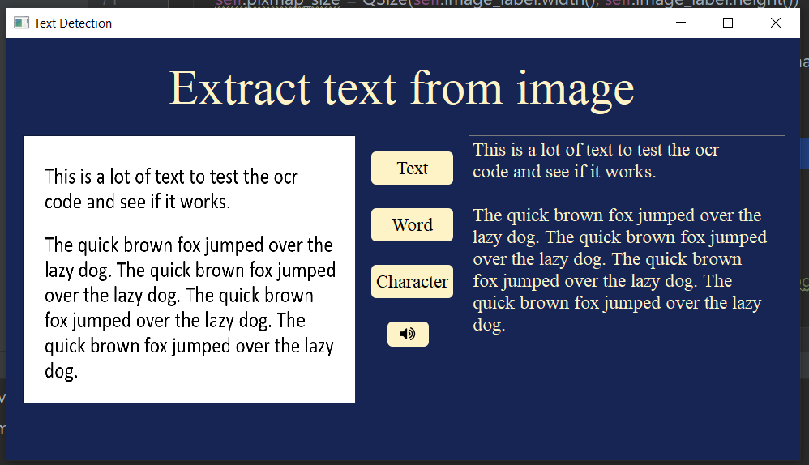

# text-recognition
# Password-generator

This code is use to visualize text recognition using pytesseract and OpenCV.
### Screenshots
Extraxt text

   

Extraxt word

   

Extraxt characters

   

### Installation
1. Install requirements.txt
2. Run text_detection.py

## Author
* **Afsaneh Shamsaddini**
